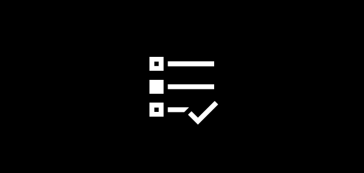

# What are the UX Tools?

UX Tools for Unreal Engine is a UE game plugin with code, blueprints and example assets created to help you add in features commonly needed when you're developing UX for mixed reality applications. The project is still in early development (it provides a small set of features and breaking changes are to be expected) but the current features are complete and robust enough to use in your own projects.  

> [!NOTE]
> Only HoloLens 2 development is supported at the moment. 

# Getting started with UX Tools

|  [Getting Started](hhttps://microsoft.github.io/MixedReality-UXTools-Unreal/version/public/0.9.x/Docs/WelcomeToUXTools.html)|  [Feature Guides](https://microsoft.github.io/MixedReality-UXTools-Unreal/version/public/0.9.x/Docs/InputSimulation.html)|  [API Reference](https://microsoft.github.io/MixedReality-UXTools-Unreal/version/public/0.9.x/api/_a_uxt_hand_interaction_actor.html)|
|:---|:---|:---|:---|

# Build status

<!-- LUIS: Does UXT have CI and Docs status links? If so, can you update below? -->
| Branch | CI Status | Docs Status |
|---|---|---|
| `public/0.9.x` ||

# Required software

<!-- LUIS: Do you have a small UE image like the Unity one used as a placeholder below? -->
<!-- LUIS: Are the descriptions and required software content correct? -->
 |  [Windows SDK 18362+](https://developer.microsoft.com/windows/downloads/windows-10-sdk)|  [Unreal 4.25.3 or later](https://www.unrealengine.com/get-now)|  [Visual Studio 2019](http://dev.windows.com/downloads)|
| :--- | :--- | :--- | :--- |
| To build apps with MRTK-Unreal and UX Tools, you need the Windows 10 May 2019 Update SDK.   To run apps for immersive headsets, you need the Windows 10 Fall Creators Update. | The Unreal Engine provides support for building mixed reality projects in Windows 10 | Visual Studio is used for code editing and deploying app packages |

# Feature areas

|  [Input Simulation](Docs/InputSimulation.md) &nbsp;  |  [Hand Interaction](Docs/HandInteraction.md) |  [Pressable Button](Docs/PressableButton.md) |  [Pinch Slider](Docs/PinchSlider.md) &nbsp; |  [Bounds Control](Docs/BoundsControl.md)|
| :--- | :--- | :--- | :--- | :--- |
|  [Manipulators](Docs/Manipulator.md) &nbsp; |  [Follow Behavior](Docs/FollowComponent.md) &nbsp; |  [Hand Constraints](Docs/HandConstraintComponent.md) |  [Palm Constraints](Docs/PalmUpConstraintComponent.md) |  [Far Beam](Docs/FarBeam.md) |

# Tools

|   [Utilities](Docs/Utilities.md) |  [Graphics](Docs/Graphics.md) | 
|:--- | :--- | :--- | :--- |
| Plugin containing a handful of tools that augment the Unreal Engine editor | Breakdown of shaders, materials, and graphics techniques used to render UX components | 

# Example maps

If you want to explore the different UXT features or want a reference for how to use them we recommend having a look at the example maps contained in the _UX Tools Game_ (/UXToolsGame) in this repository. For that you should:

1. [Clone](https://help.github.com/en/desktop/contributing-to-projects/cloning-a-repository-from-github-to-github-desktop) this repository.
1. [Checkout](https://help.github.com/en/desktop/contributing-to-projects/switching-between-branches) public/0.9.x. 
    * Bear in mind that this branch is alive. It's not a release, and will be **updated regularly with potentially breaking changes**. There will be a release tag (e.g. release/0.9.0) marked as such in GitHub.

You can now open the _UX Tools Game_ (/UXToolsGame) and explore individual example maps or open the _Loader_ level to access some of the examples from a centralized hub. 

# Packaged UX Tools game

We also provide the UX Tools game pre-packaged for HoloLens 2 so you can try out the main UXT features directly on device easily. To use it:

1. Obtain the packaged game from the latest release page (e.g. _UXTGame-HoloLens.0.9.0.zip_) and unzip it to a local directory.
1. Install it in the device via the [Device Portal](https://docs.microsoft.com/en-us/windows/uwp/debug-test-perf/device-portal-hololens).

# Documentation

The latest version of the documentation can be found [here](https://microsoft.github.io/MixedReality-UXTools-Unreal/version/public/0.9.x/Docs/WelcomeToUXTools.html).

# Feedback and contributions

Due to the early stage of the project and the likelihood of internal refactors, we are not in a position to accept external contributions through pull requests at this time. However, contributions and feedback in the shape of bug reports, suggestions and feature requests are always welcome!
