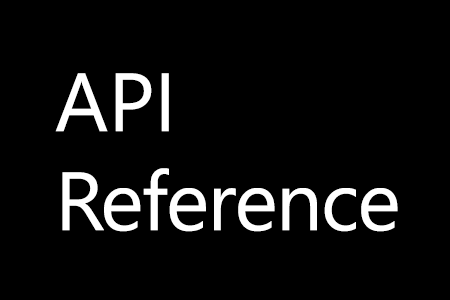
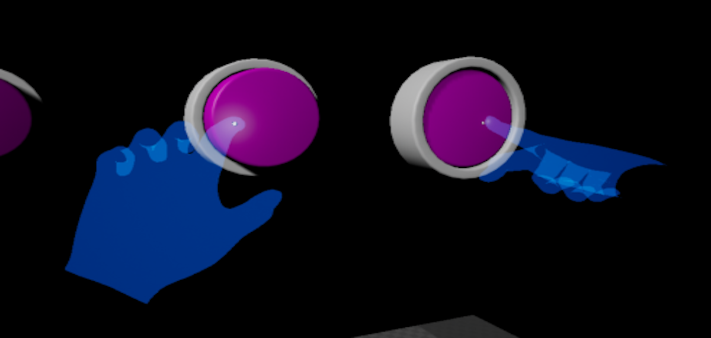
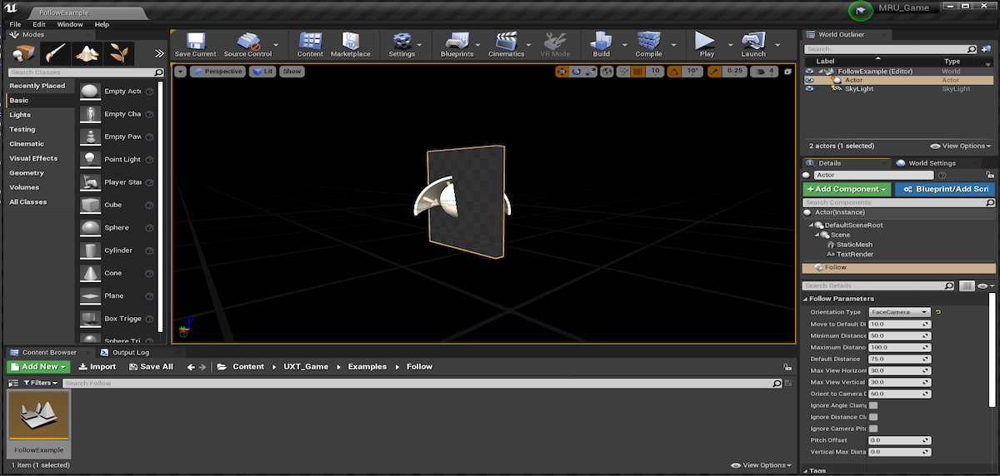

# What are the UX Tools?

UX Tools for Unreal Engine is a UE game plugin with code, blueprints and example assets created to help you add in features commonly needed when you're developing UX for mixed reality applications. The project is still in early development (it provides a small set of features and breaking changes are to be expected) but the current features are complete and robust enough to use in your own projects.  

> [!NOTE]
> Only HoloLens 2 development is supported at the moment. 

# Getting started with UX Tools

|  [Getting Started](https://docs.microsoft.com/windows/mixed-reality/unreal-development-overview?tabs=mrtk%2Casa)|  [Feature Guides](https://microsoft.github.io/MixedReality-UXTools-Unreal/version/public/0.9.x/Docs/InputSimulation.html)|  [API Reference](https://microsoft.github.io/MixedReality-UXTools-Unreal/version/public/0.9.x/api/_a_uxt_hand_interaction_actor.html)|
|:---|:---|:---|

# Required software

 |  [Windows SDK 18362+](https://developer.microsoft.com/windows/downloads/windows-10-sdk)|  [Unreal 4.25.3 or later](https://www.unrealengine.com/get-now)|  [Visual Studio 2019](http://dev.windows.com/downloads)|
| :--- | :--- | :--- | 
| To build apps with MRTK-Unreal and UX Tools, you need the Windows 10 May 2019 Update SDK | The Unreal Engine provides support for building mixed reality projects in Windows 10 | Visual Studio is used for code editing |

# UX building blocks

|   [Input Simulation](Docs/InputSimulation.md) |  [Hand Interaction](Docs/HandInteraction.md) |  [Pressable Button](Docs/PressableButton.md) |
|:--- | :--- | :--- |
| Mouse and keyboard input in the editor to simulate a Head-Mounted Display and hand tracking | Hand interaction actor that takes care of creating and driving pointers and visuals for interactions | A button gives the user a way to trigger an immediate action |
|   [Pinch Slider](Docs/PinchSlider.md) |  [Bounds Control](Docs/BoundsControl.md) |  [Manipulators](Docs/Manipulator.md) |
| A component allows the user to continuously change a value by moving the slider thumb along the track | A component that allows the user to change the position, rotation, and size of an actor | A component that allows an actor to be picked up by a user and then moved, rotated or scaled |
|   [Follow Behavior](Docs/FollowComponent.md) |  [Hand Constraints](Docs/HandConstraintComponent.md) |  [Palm Constraints](Docs/PalmUpConstraintComponent.md) |
| A component used to keep objects "following" the user by applying a set of constraints on the component's owner | A component that calculates a goal based on hand tracking and moves the owning actor | A hand constraint component specialization that activates only when the palm is facing the player |
|   [Far Beam](Docs/FarBeam.md) | 
| A component allowing the user to visualize elements in the scene they can interact with from afar |

# Tools

|   [Utilities](Docs/Utilities.md) |  [Graphics](Docs/Graphics.md) | 
|:--- | :--- | 
| Plugin containing a handful of tools that augment the Unreal Engine editor | Breakdown of shaders, materials, and graphics techniques used to render UX components | 

# Example maps

If you want to explore the different UXT features or want a reference for how to use them we recommend having a look at the example maps contained in the _UX Tools Game_ (/UXToolsGame) in this repository. For that you should:

1. [Clone](https://help.github.com/en/desktop/contributing-to-projects/cloning-a-repository-from-github-to-github-desktop) this repository.
1. [Checkout](https://help.github.com/en/desktop/contributing-to-projects/switching-between-branches) public/0.9.x. 
    * Bear in mind that this branch is alive. It's not a release, and will be **updated regularly with potentially breaking changes**. There will be a release tag (e.g. release/0.9.0) marked as such in GitHub.

You can now open the _UX Tools Game_ (/UXToolsGame) and explore individual example maps or open the _Loader_ level to access some of the examples from a centralized hub. 

# Packaged UX Tools game

We also provide the UX Tools game pre-packaged for HoloLens 2 so you can try out the main UXT features directly on device easily. To use it:

1. Obtain the packaged game from the latest release page (e.g. _UXTGame-HoloLens.0.9.0.zip_) and unzip it to a local directory.
1. Install it in the device via the [Device Portal](https://docs.microsoft.com/en-us/windows/uwp/debug-test-perf/device-portal-hololens).

# Documentation

The latest version of the documentation can be found [here](https://microsoft.github.io/MixedReality-UXTools-Unreal/version/public/0.9.x/Docs/WelcomeToUXTools.html).

# Feedback and contributions

Due to the early stage of the project and the likelihood of internal refactors, we are not in a position to accept external contributions through pull requests at this time. However, contributions and feedback in the shape of bug reports, suggestions and feature requests are always welcome!
